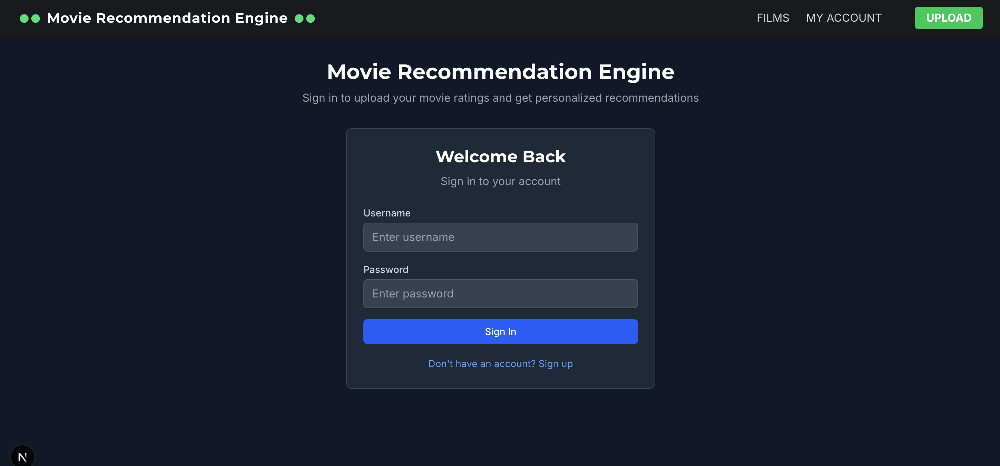
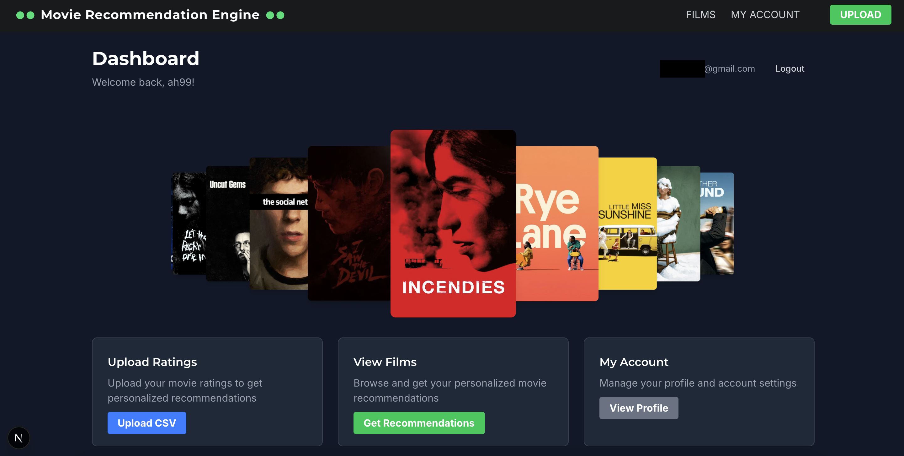

# Movie Recommendations System

A full-stack movie recommendation application that provides personalized movie suggestions based on user ratings and advanced machine learning algorithms.

<!---->

## Features

- **Weekly Recommendations**: Receive curated weekly movie picks with source movie explanations
- **Advanced ML Pipeline**: K-Nearest Neighbors with clustering for diverse recommendations
- **Real-time Movie Data**: Integration with The Movie Database (TMDB) API
- **Streaming Information**: See where to watch recommended movies across different platforms
- **User Authentication**: JWT-based authentication system with user registration/login
- **User Rating System**: Rate movies individually or upload bulk ratings via CSV
- **Modern Web Interface**: Responsive Next.js frontend with Tailwind CSS
- **RESTful API**: FastAPI backend with comprehensive endpoints

## Architecture

### Backend (FastAPI + SQLAlchemy)
- **Framework**: FastAPI with automatic API documentation
- **Database**: SQLite with SQLAlchemy ORM
- **ML Pipeline**: scikit-learn with K-Nearest Neighbors and clustering algorithms
- **Authentication**: JWT-based authentication with password hashing
- **External APIs**: The Movie Database (TMDB) integration for movie data and streaming info
- **Features**: User management, rating system, recommendation engine, CSV upload, weekly recommendations

### Frontend (Next.js)
- **Framework**: Next.js 15 with App Router
- **Styling**: Tailwind CSS for responsive design
- **Language**: TypeScript for type safety
- **State Management**: React hooks for client-side state
- **Pages**: Home, Weekly Recommendations, Upload, Account management

## API Endpoints

### Authentication
- `POST /api/auth/register` - Register new user
- `POST /api/auth/login` - Login user
- `GET /api/auth/me` - Get current user info

### Recommendations
- `GET /api/recommendations` - Get personalized movie recommendations (requires auth)
- `GET /api/user-top-movies/{user_id}` - Get user's top-rated movies
- `GET /api/weekly-recommendation/{user_id}` - Get weekly movie recommendation
- `GET /api/weekly-recommendation-status/{user_id}` - Get weekly recommendation status

### Ratings
- `POST /api/ratings` - Add a new movie rating
- `GET /api/ratings` - Get all ratings
- `POST /api/ratings/upload` - Upload ratings via CSV file

## Database Schema

### Users
- `id` (Primary Key)
- `username` (Unique)
- `email` (Unique)
- `hashed_password`

### Movies
- `id` (Primary Key)
- `title`
- `genre`
- `director`
- `year`

### Ratings
- `id` (Primary Key)
- `user_id` (Foreign Key)
- `movie_id` (Foreign Key)
- `rating` (Float)

### Recommendations
- `id` (Primary Key)
- `user_id` (Foreign Key)
- `movie_id` (Foreign Key)
- `source_movies` (String) - Comma-separated list of source movie names
- `time_generated` (DateTime) - When the recommendation was created

## Machine Learning Features

### Recommendation Engine
- **Content-based Filtering**: K-Nearest Neighbors algorithm
- **Feature Engineering**: Genre, language, and cast member analysis
- **Clustering**: K-means clustering for diverse recommendations
- **Weighted Scoring**: Combines user ratings with movie popularity
- **Diversity Enhancement**: Ensures recommendations span different genres/styles

### Weekly Recommendations
- **Source Movie Tracking**: Shows which movies influenced each recommendation
- **Weekly Cycle**: New recommendations generated every 7 days
- **Caching**: Recommendations stored in database to avoid regeneration
- **Smart Fallback**: Recreates missing movies from TMDB when needed

### Model Training
- Trained on top-rated movies dataset
- Feature preprocessing with StandardScaler
- Genre and language one-hot encoding
- Cast member analysis for similarity matching

## External Integrations

### The Movie Database (TMDB)
- **Movie Data**: Fetch detailed movie information including cast, director, and metadata
- **Streaming Data**: Get where movies are available to stream, rent, or buy
- **Poster & Backdrop Images**: High-quality movie artwork
- **Search Functionality**: Find movies by name for rating uploads

### Key Technologies
- **Backend**: FastAPI, SQLAlchemy, scikit-learn, pandas, numpy, JWT
- **Frontend**: Next.js, React, TypeScript, Tailwind CSS
- **Database**: SQLite
- **External APIs**: The Movie Database (TMDB)
- **Authentication**: JWT tokens with password hashing
